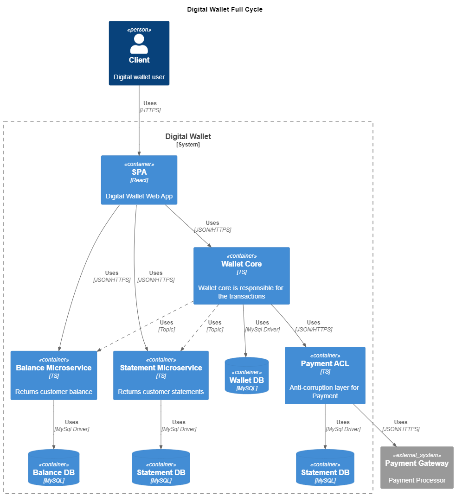

# 1. Arquitetura baseada em microsserviços

- [1. Arquitetura baseada em microsserviços](#1-arquitetura-baseada-em-microsserviços)
  - [1.1. Conceitos básicos](#11-conceitos-básicos)
    - [1.1.1. O que são microserviços?](#111-o-que-são-microserviços)
    - [1.1.2. Microsserviços vs Monolíticos](#112-microsserviços-vs-monolíticos)
    - [1.1.3. Quando utilizar microsserviços?](#113-quando-utilizar-microsserviços)
    - [1.1.4. Quando utilizar sistemas monolíticos?](#114-quando-utilizar-sistemas-monolíticos)
    - [1.1.5. Migração de monolitos para microsserviços](#115-migração-de-monolitos-para-microsserviços)
  - [1.2. Características de Microsserviços](#12-características-de-microsserviços)
    - [1.2.1. Componentização](#121-componentização)
    - [1.2.2. Capacidades de negócio (Context)](#122-capacidades-de-negócio-context)
    - [1.2.3. Produtos e não projetos](#123-produtos-e-não-projetos)
    - [1.2.4. Smart endpoints and dumb pipes](#124-smart-endpoints-and-dumb-pipes)
    - [1.2.5. Governança descentralizada](#125-governança-descentralizada)
    - [1.2.6. Dados descentralizados (Banco de Dados)](#126-dados-descentralizados-banco-de-dados)
    - [1.2.7. Automação de infraestrutura (DevOps)](#127-automação-de-infraestrutura-devops)
    - [1.2.8. Desenhado para falhar (Resiliência)](#128-desenhado-para-falhar-resiliência)
    - [1.2.9. Design evolutivo](#129-design-evolutivo)
  - [1.3. Resiliência](#13-resiliência)
    - [1.3.1. Introdução à Resiliência](#131-introdução-à-resiliência)
    - [1.3.2. O que é resiliência?](#132-o-que-é-resiliência)
    - [1.3.3. Estratégias: Proteger e ser protegido](#133-estratégias-proteger-e-ser-protegido)
    - [1.3.4. Helth check](#134-helth-check)
    - [1.3.5. Rate limiting](#135-rate-limiting)
    - [1.3.6. Circuit Breaker](#136-circuit-breaker)
    - [1.3.7. API Gateway](#137-api-gateway)
    - [1.3.8. Service Mesh](#138-service-mesh)
    - [1.3.9. Trabalhe de forma assíncrona](#139-trabalhe-de-forma-assíncrona)
    - [1.3.10. Retry](#1310-retry)
    - [1.3.11. Garantias de entrega](#1311-garantias-de-entrega)
    - [1.3.12. Situações complexas](#1312-situações-complexas)
    - [1.3.13. Transacional outbox](#1313-transacional-outbox)
    - [1.3.14. Garantias de recebimento](#1314-garantias-de-recebimento)
    - [1.3.15. Idempotência e políticas de fallback](#1315-idempotência-e-políticas-de-fallback)
    - [1.3.16. Observabilidade](#1316-observabilidade)
  - [1.4. Coreografia vs Orquestração](#14-coreografia-vs-orquestração)
    - [1.4.1. Como funciona a Coreografia](#141-como-funciona-a-coreografia)
    - [1.4.2. Dinâmica de Orquestração](#142-dinâmica-de-orquestração)
    - [1.4.3. Estratégias de APIs](#143-estratégias-de-apis)
  - [1.5. Patterns](#15-patterns)
    - [1.5.1. API Composition](#151-api-composition)
    - [1.5.2. Decompose by business capability](#152-decompose-by-business-capability)
    - [1.5.3. Stragler application](#153-stragler-application)
    - [1.5.4. Anti-corruption layer (ACL)](#154-anti-corruption-layer-acl)
    - [1.5.5. API Gateway](#155-api-gateway)
    - [1.5.6. Backend for Frontend (BFF)](#156-backend-for-frontend-bff)
    - [1.5.7. Banco de Dados](#157-banco-de-dados)
    - [1.5.8. Relatórios e consolidação de informações](#158-relatórios-e-consolidação-de-informações)
    - [1.5.9. Transactional outbox](#159-transactional-outbox)
    - [1.5.10. Secret Manager](#1510-secret-manager)
    - [1.5.11. Padronização de Logs](#1511-padronização-de-logs)
    - [1.5.12. Open Telemetry](#1512-open-telemetry)
    - [1.5.13. Service Template](#1513-service-template)
  - [1.6. C4 Model](#16-c4-model)
    - [1.6.1. System context diagram](#161-system-context-diagram)
    - [1.6.2. Container diagram](#162-container-diagram)
    - [1.6.3. Component diagram](#163-component-diagram)
    - [1.6.4. Code diagram](#164-code-diagram)
    - [1.6.5. PlantUML: Diagram as code](#165-plantuml-diagram-as-code)
  - [1.7. Microserviços WalletCore](#17-microserviços-walletcore)


---

<br>

## 1.1. Conceitos básicos

---

<br>

### 1.1.1. O que são microserviços?
	
- Microserviços são aplicações comuns
- Tem objetivos bem definidos
- Faz parte de um ecosistema
- São independentes (ou autônomos)
- Se comunicam o tempo todo

[^1]

<br>

> :bulb: **OpenIA:** "Explique resumidamente o que é 'Arquitetura baseada em microsserviços'"
>
> A arquitetura baseada em microsserviços é um modelo de desenvolvimento de software que consiste em dividir um aplicativo em partes menores e independentes, conhecidas como microsserviços. Cada microsserviço é responsável por uma tarefa específica e pode ser desenvolvido, implantado e escalado separadamente. Essa abordagem permite que as equipes de desenvolvimento trabalhem de forma mais eficiente e permite que as empresas adaptem suas aplicações com mais facilidade às mudanças de demanda e de mercado. No entanto, essa arquitetura também pode apresentar desafios, como a complexidade do gerenciamento de várias partes do aplicativo e a necessidade de comunicação eficiente entre os diferentes microsserviços.[^2]

<br>

---

### 1.1.2. Microsserviços vs Monolíticos

| Aspecto        | Microserviços           | Monolito                       |
| :------------- | :---------------------- | :----------------------------- |
| Objetivo       | Domínio bem definido    | Todos contextos em um sistema  |
| Tecnologia     | Diversas                | Única                          |
| Deploy         | Menor risco             | Maior risco                    |
| Organizacional | Uma equipe por contexto | Todas equipes no mesmo sistema |
| POC            | Complexo                | Mais simples                   |

[^1]

<br>

---

### 1.1.3. Quando utilizar microsserviços?
	
- Escalar times?
- Contextos bem definidos?
- Maturidade do processo de entrega?
- Maturidade técnica dos times?
- Necessidade de escalar uma parte do sistema?
- Tecnologias específicas em parte do sistema?

<br>

> :memo: **Nota:** 	
> É preciso ter o processo de entrega pronto:
> - CI/CD
> - Clusters
> - Deploy
> - Autoscaling

[^1]

<br>

---

### 1.1.4. Quando utilizar sistemas monolíticos?

- POC - prova de conceito?
- Início de um projeto? Onde não se conhece todo o domínio do sistema
- Governança simplificada sobre as tecnologias
- Facilidade de contratação
- Facilidade no treinamento de times
- Tudo em um lugar
- Compartilhamento claro de libs (Shared Kernel)

[^1]

<br>

---

### 1.1.5. Migração de monolitos para microsserviços

Checkpoints:
- Separação de contextos (DDD)
- Evite excesso de granularidade
- Verificar dependências
- Planeje o processo de migração de banco de dados
- Não tenha medo de duplicação de dados
- Comunicação assíncrona - Pensar em 'Eventos!'
- Consistência eventual
- CI/CD/Testes/Ambientes
- Comece pelos sistemas periféricos (pelas beiradas)
- Padrão de estrangulamento

[^1]

<br>

---

## 1.2. Características de Microsserviços

[^1]

<br>

---

### 1.2.1. Componentização

- Independência de Deploy (Implantação)
- Pode ser substituível
- Permite alteração fácil e independente

<br>

---

### 1.2.2. Capacidades de negócio (Context)

Como a organização se comunica na empresa?

Organização através das áreas de negócio - Melvin Conway, 1968
- O times são cross-functional
- Focado em uma área de negócio

<br>

---

### 1.2.3. Produtos e não projetos

- Você desenvolveu, você mantém

<br>

---

### 1.2.4. Smart endpoints and dumb pipes

- Antigamente: ESB - Transformação de formatos (XML para JSON)
- Hoje: Comunicação pura, REST com JSON

<br>

---

### 1.2.5. Governança descentralizada

- A forma de determinar tecnologias	
*"... not every problem is a nail and not every solution is a hammer."*

- Consumer driven contracts

<br>

---

### 1.2.6. Dados descentralizados (Banco de Dados)

- Gerenciamento de dados descentralizado
- Cada contexto pode ter seu banco de dados
- É possível ter um banco por responsabilidade ou microserviço

<br>

---

### 1.2.7. Automação de infraestrutura (DevOps)

- Compila, testes, segurança, deploy, recurso computacional
- Docker, VM, Kubernets, Cloud, etc...

<br>

---

### 1.2.8. Desenhado para falhar (Resiliência)
	
o que fazer?
- Quando a fila cair
- Banco de dados fora?
- Rede fora

<br>

---

### 1.2.9. Design evolutivo

- Possibilidade de subir e fazer upgrade de um componente 
sem afetar outras partes

- Se precisar mudar 2 seriços para subir uma feature,
eles deveriam ser um só serviço.

- Monolitos distribuídos: o pior dos mundos

<br>

---

## 1.3. Resiliência

<br>

---

### 1.3.1. Introdução à Resiliência

- Em algum momento todo sistema vai falhar.
- Práticas para mitigar

<br>

---

### 1.3.2. O que é resiliência?

- Resiliência é um conjunto de estratégias adotadas intensionalmente para a adaptação de um sistema quando uma falha ocorre;

- Ter estratégias de resiliência possibilita minimizar os riscos com perda de dados e transações importantes para o negócio.

<br>

> "Resiliência é a capacidade de se adaptar e se recuperar de situações difíceis"
> OpenIA

<br>

---

### 1.3.3. Estratégias: Proteger e ser protegido

Quais principais estratégias para resiliência?

- Mecanismos de autopreservação para garantir	ao máximo sua operação com qualidade
- Não pode ser "egoísta" ao ponto de realizar	mais requisições em outro sistema falhando
- Um sistema lento no ar muitas vezes é pior do	que um sistema fora do ar. (Efeito dominó)

<br>

---

### 1.3.4. Helth check

Verificar a saúde do sistema
- E dependências (Banco de dados, filas, etc)

Um sistema não saudável possui chance de se recuperar 
- Caso o tráfego pare temporariamente

Health check de qualidade
- Ativo: auto verificação
- Passivo: somente quando acessado por outro

<br>

---

### 1.3.5. Rate limiting

Protege o sistema baseado no que ele foi projetado para suportar.

- Eu garanto qualidade até este limite
- Quantidade máxima de requisições
- Preferências (grupos) por tipo de client

<br>

---

### 1.3.6. Circuit Breaker

Protege o sistema fazendo com que as requisições feitas para ele sejam negadas:		
- Circuito fechado = requisições chegam normalmente
- Circuito aberto = requisições não chegam ao sistema

Meio aberto = Permite uma quantidade limitada de requisições, para verificar condições de voltar integralmente

> Questões:
> - O desenvolvedor deve pensar nos limites?
> - Service Mesh?

<br>

---

### 1.3.7. API Gateway

- Garantem validações de requisições "inapropriadas"
- O que passou da API Gateway está autenticado e é seguro
- Políticas Rate Limiting, Healph check, etc
- Ajuda a criar contextos

<br>

---

### 1.3.8. Service Mesh

- Controla o tráfego na rede
- Evita implementação de proteção pelo próprio sistema.
- Permite visualizar
- Proxy
- mTLS - ( Antigo ssl ) - garantia de certificados
- Permite implementar no service mesh:
- - Circuit breaker, retry, timeout, fault injection, etc

<br>

---

### 1.3.9. Trabalhe de forma assíncrona

- Evita perda de dados
- O servidor pode processar em seu tempo
- Entender com profundidade o messagem broker / sistema de stream

<br>

---

### 1.3.10. Retry

- Garantias de entregas
- Exponential backoff: Retry 1s, 3s, 10s, etc
- Exponential backoff + Jitter: Retry 1s + random number

<br>

---

### 1.3.11. Garantias de entrega

```
Ack 0 (None)
- Sem nenhuma resposta do broker (Fire and Forget)
- Maior performance
- Menor garantia

Ack 1 (Leader)
- Líder retorna resposta

Ack -1 (All)
- Líder retorna resposta após entregar p/ seguidores
- Menor performance
- Maior garantia
```

<br>

---

### 1.3.12. Situações complexas

- O que acontece se o message broker cair?
- Haverá perda de mensagens?
- Seu sistema ficará fora do ar?
- Como garantir resiliência?

<br>

---

### 1.3.13. Transacional outbox

	- Se a mensagem para o Kafka se perder?

```
Estrutura:
  - Service
  - Database
    + Table Account (insert, update, delete)
    + Table outbound MSG (insert)
  - Kafka
	
Fluxo:
  1. Service envia mensagem
  2. Salva na tabela de negocio
  3. Salva na tabela outbound
  4. Envia para Kafka
  4.1. Kafka retornou OK ? Deleta o registro MSG
  4.2. Kafka retornou NOK ? Mantém o registro MSG	

  # Quando o serviço BROKER retornar, todas MSG serão reenviadas.
```
	
ESTRUTURA OUTBOUND

| MessageID          | Key     | Topic                | Payload (JSON)                                |
| :----------------- | :------ | :------------------- | :-------------------------------------------- |
| 7fd1b0eb-b954-42d7 | Account | account_transactions | {"id": "5jd2r0eb-b735-74d8", "nome": "Johny"} |

<br>

---

### 1.3.14. Garantias de recebimento

- Auto Ack = false e commit manual
- Prefetch alinhado a volumetria

```
----------------------------------------
- Auto Ack = false e commit manual

Ex: RabbitMQ
* Se tirou a MSG do Broker, o service falhou.
* Auto Ack = false e commit manual

----------------------------------------
- Prefetch alinhado a volumetria.

* Verificar quantas mensagens seu Consumer pode receber.

----------------------------------------
```

> Glossary:
> * Auto-acknowledgment - mecanismo de confirmação de entrega

<br>

---

### 1.3.15. Idempotência e políticas de fallback

a) Idempotência: o ato de lidar com duplicidade

> Ex:
> MSG processada
> MSG processada novamente

b) Independência. Ex: Banco de dados

c) Políticas claras de fallback

> Ex:
> Network
> Divisão subnets
> Milhares de máquinas
> 
> - AWS fica fora do ar, uma zona da subrede caiu
> - AWS redireciona, mas não havia suporte para qtd novos IP's

<br>

---

### 1.3.16. Observabilidade

APM: aplication performance monitor

- Tracing distribuído
- Métricas personalizadas (Alertas de anomalias)
- Spans personalizados
- Open Telemetry


---

## 1.4. Coreografia vs Orquestração

<br>

---

### 1.4.1. Como funciona a Coreografia

Microserviços se chamando com uma rede de comunicação muito grande.
- Death star netflix

<br>

---

### 1.4.2. Dinâmica de Orquestração

- Orquestração com ordem das coisas, de forma que possam ser desfeitas

- O maestro coordena o processo de chamada dos serviços
	
```
	Orquestrador (ID=1)
	- [OK]  - Checkout
	- [OK]  - Payment
	- [OK]  - Stock
	- [NOK] - Centro Distribuição
	- [ ]   - Invoice
	- [ ]   - Shipping
	
	Orquestrador - (redirect)
	- [ID=1]  - Checkout
	- [ID=1]  - Payment
	- [ID=1]  - Stock
	- [OK]    - Centro Distribuição II
	- [OK]    - Invoice
	- [OK]    - Shipping
	
	Orquestrador (fail, revert)
	- [Revert]  - Checkout
	- [Revert]  - Payment
	- [Revert]  - Stock
	- [ ]       - Centro Distribuição
	- [ ]       - Invoice
	- [ ]       - Shipping
```

<br>

---

### 1.4.3. Estratégias de APIs

	- Mitigação da estrela da morte
	- Mini API Gateway (proxy) por contextos.
		
	Ex.: /payment/*
	- Rate limit

<br>

---

## 1.5. Patterns

<br>

---

### 1.5.1. API Composition

> Application patterns | Data patterns | Querying
> 
> API Composition - implement queries by invoking the services that own the data and performing an in-memory join

<br>

Para gerar um relatório e é necessário buscar dados que estão em mais de um microserviço, utiliza-se este padrão para realizar a chamada para todos os serviços envolvidos e formatar uma resposta.

	API Composition: Dados 
	- Serviço A
	- Serviço B

<br>

> :bulb: **OpenIA:** "Explique resumidamente o que é 'API Composition' em 'Microservices Pattern'"
>
> API Composition é um padrão de microserviço que lida com a criação de APIs mais complexas, combinando várias APIs de menor escala. Essas APIs menores são projetadas para executar funções específicas, mas quando combinadas, podem criar uma API mais poderosa e funcional. O padrão de API Composition permite que os desenvolvedores criem soluções mais flexíveis, escaláveis e fáceis de manter, reduzindo a complexidade geral do sistema. Além disso, a API Composition também oferece aos desenvolvedores a capacidade de implementar soluções personalizadas para atender às necessidades específicas de um cliente ou aplicativo.[^3]

<br>

---

### 1.5.2. Decompose by business capability

> Application patterns | Decomposition
>
> Decompose by business capability - define services corresponding to business capabilities.

<br>

Em oposição a um monolito, este pattern orienta criar a criação de serviços agrupados nos contextos de cada área de negócio.

Pontos de atenção:
- Áreas cinzentas
- Extrair um módulo pode impactar outros módulos
- Mapear contextos e core do sistema com DDD
- Banco de dados: compartilhado ou separado?

<br>

> :bulb: **OpenIA:** "Explique resumidamente o que é 'Decompose by business capability' em 'Microservices Pattern'"
>
> "Decompose by business capability" é um padrão de microserviço em que os serviços são divididos com base nas capacidades de negócios de uma organização. Em vez de separar os serviços com base em sua funcionalidade técnica, esse padrão considera as necessidades de negócios da organização e divide os serviços de acordo com as tarefas que eles executam. Isso permite que a organização ajuste seus serviços à medida que suas necessidades mudam e torna o sistema mais flexível e fácil de manter. Ao utilizar o padrão "Decompose by business capability", as organizações podem criar soluções mais escaláveis, permitindo que elas se adaptem rapidamente às mudanças no mercado ou às necessidades dos clientes.[^4]

<br>

---

### 1.5.3. Stragler application

> Application patterns | Refactoring to microservices
>
> Stragler application - modernize an application by incrementally developing a new (strangler) application around the legacy application.

<br>

Como migrar um monolito aos poucos?

Seguir esta regra:
1. Toda nova feature será desenvolvida em novos em microserviços
2. Separar pequenas partes para criar microserviços

Pontos de atenção
- Comunicação com o monolito
- Maturidade da equipe	
- APM - Application Performance Monitoring
- Cada microserviço precisa de um APM (no dia 1)
- Métricas? O diferente do esperado precisa de um alarme

<br>

> :bulb: **OpenIA:** "Explique resumidamente o que é 'Stragler application' em 'Microservices Pattern'"
>
> Straggler application é um padrão de microserviço que se concentra em gerenciar aplicativos que consomem uma quantidade excessiva de recursos ou demoram mais para concluir sua tarefa do que outras partes do sistema. Esses aplicativos, conhecidos como "stragglers", podem afetar o desempenho geral do sistema, causando atrasos ou congestionamentos. O padrão Straggler application aborda esse problema ao permitir que esses aplicativos sejam isolados em seus próprios contêineres ou microsserviços, permitindo que o restante do sistema continue operando normalmente. Isso ajuda a garantir que o desempenho do sistema permaneça constante, mesmo quando alguns aplicativos estão demorando mais do que o esperado para concluir suas tarefas.[^5]

<br>

---

### 1.5.4. Anti-corruption layer (ACL)

> Application patterns | Anti-corruption layer (ACL)
>
> Anti-corruption layer - define an anti-corruption layer, which translates between the two domain models.

<br>

A definição de uma interface para abstrair a comunicação entre outros dois serviços, encapsulando uma capacidade de negócio para evitar acoplamento com outros serviços.

<br>

> :bulb: **OpenIA:** "Explique resumidamente o que é 'Anti-corruption layer' em 'Microservices Pattern'"
>
> Anti-corruption layer é um padrão de microserviço que lida com a integração entre sistemas que usam diferentes modelos de dados ou protocolos de comunicação. Quando um sistema é atualizado ou substituído, ele pode afetar outros sistemas que dependem dele, tornando difícil manter a integridade do sistema como um todo. O padrão Anti-corruption layer aborda esse problema, adicionando uma camada que traduz as chamadas de serviço ou dados entre sistemas, permitindo que cada sistema mantenha seu próprio modelo de dados e protocolos de comunicação. Isso permite que os sistemas coexistam e sejam atualizados independentemente um do outro, sem afetar a funcionalidade geral do sistema. O Anti-corruption layer é especialmente útil quando há uma grande quantidade de sistemas legados envolvidos, ou quando a integração é feita com sistemas de terceiros.[^6]

<br>

---

### 1.5.5. API Gateway

> Application Infrastructure patterns | External API
>
> API Gateway - a service that provides each client with unified interface to services.

<br>

Um ponto único de entrada para sua malha de microservices.

Recursos
- Rate limiting
- Data transform (XML <-> JSON)
- Autentication & Autorization (Keycloak)
- Load balance
- Roteamento e 
- Cache

Ferramentas
* Kong API Gateway (Enginx)
* Provedores Clouds possuem diversas

Tipos
- Stateless
- Statefull

<br>

> :bulb: **OpenIA:** "Explique resumidamente o que é 'API Gateway' em 'Microservices Pattern'"
>
> API Gateway é um padrão de microserviço que atua como uma camada intermediária entre os clientes e os microsserviços em um sistema. Ele é responsável por gerenciar as chamadas de API para diferentes microsserviços e fornecer uma interface simplificada para os clientes interagirem com o sistema. O API Gateway pode executar funções como autenticação, autorização, balanceamento de carga, roteamento e cache, para melhorar a segurança e o desempenho do sistema como um todo. Ao usar o padrão API Gateway, as organizações podem criar sistemas mais escaláveis e flexíveis, permitindo que elas adicionem ou removam microsserviços sem afetar a experiência do cliente.[^7]

<br>

---

### 1.5.6. Backend for Frontend (BFF)

> Application Infrastructure patterns | External API
>
> Backend for Frontend - a separate API gateway for each kind of client.

<br>

Em um ambiente em que existem muitos tipos de clientes (Desktop, Mobile, TV, etc), cria-se um serviço que retorna somente as informações necessárias. Para cada tipo de cliente é possível criar um tipo de retorno específico.

Segrega os recursos de acordo com o tipo de cliente.

<br>

> :bulb: **OpenIA:** "Explique resumidamente o que é 'Backend for Frontend' em 'Microservices Pattern'"
>
> Backend for Frontend (BFF) é um padrão de microserviço que envolve a criação de um serviço backend dedicado para cada cliente ou aplicação frontend. Isso permite que cada cliente tenha acesso apenas aos dados e funcionalidades relevantes para sua experiência específica, reduzindo o tráfego e melhorando o desempenho do sistema como um todo. O BFF também pode ajudar a simplificar a lógica de negócios e melhorar a segurança, permitindo que os serviços backend sejam adaptados para atender às necessidades específicas de cada aplicativo. Este padrão é particularmente útil em sistemas com vários aplicativos frontend que precisam se integrar com diferentes microsserviços, permitindo que cada aplicativo tenha seu próprio backend otimizado para atender suas necessidades.[^8]

<br>

---

### 1.5.7. Banco de Dados

> Application patterns | Data patterns
>
> Database per Service - each service has its own private database
> Shared database - services share a database

<br>

É a definição da forma de acessar o banco de dados, se haverá um serviço único ou se existirão múltiplos serviços acessando um mesmo banco de dados.

<br>

> :bulb: **OpenIA:** "Explique resumidamente o que é 'Banco de Dados' em 'Microservices Pattern'"
>
> Em sistemas baseados em microserviços, o padrão de Banco de Dados é utilizado para separar a lógica de dados em microsserviços independentes. Cada microsserviço pode ter seu próprio banco de dados, o que ajuda a garantir a independência dos serviços e a escalabilidade do sistema. No entanto, isso também pode criar desafios de integração de dados, já que os dados precisam ser compartilhados entre os microsserviços para garantir a integridade do sistema. Para lidar com esses desafios, os padrões de Event Sourcing e Change Data Capture (CDC) são frequentemente utilizados para garantir que os dados sejam atualizados em tempo real em todos os microsserviços relevantes. Além disso, o uso de bancos de dados NoSQL pode ser vantajoso em sistemas baseados em microsserviços, já que eles são projetados para serem escaláveis e flexíveis, permitindo que os dados sejam facilmente distribuídos em diferentes microsserviços.[^9]

<br>

---

### 1.5.8. Relatórios e consolidação de informações

> Application patterns | Data patterns
>
> Relatórios e consolidação de informações - Overview.

<br>

Opções para acessar grandes volumes de dados
- Gerar em background
- Um novo serviço fica consolidando dados através de agendamento
- Consolidação através de eventos, MSG enviadas em filas

<br>

---

### 1.5.9. Transactional outbox

> Application Infrastructure patterns | Transational
>
> Transactional outbox - Overview.

<br>

Uma tabela persiste a mensagem antes de enviar uma requisição, e então após enviar a requisição deleta a mensagem.

| ID   | HOST   | Metadata | Timestamp  | Request                    |
| :--- | :----- | :------- | :--------- | :------------------------- |
| 0    | server | abc      | 2023-04-01 | {"id": 1, "name": "John" } |

Opções de banco de dados
- RDBMS
- KV - DynamodDB
- Cache (Redis)

<br>

> :bulb: **OpenIA:** "Explique resumidamente o que é 'Transactional outbox' em 'Microservices Pattern'"
>
> O padrão Transactional Outbox é uma abordagem para garantir a consistência de dados em uma arquitetura de microsserviços. Nesse padrão, quando uma transação é concluída, em vez de enviar diretamente uma mensagem para um serviço externo, os dados necessários para enviar a mensagem são gravados em um outbox (um registro na própria aplicação). Em seguida, um serviço interno ou externo pode ler o outbox e enviar as mensagens pendentes. Esse processo é totalmente dentro dos limites da transação, garantindo assim a consistência dos dados. Em outras palavras, o Transactional Outbox é uma técnica para enviar mensagens a partir de microsserviços sem comprometer a integridade dos dados em caso de falha.[^10]

<br>

---

### 1.5.10. Secret Manager

> Group | Subgroup
>
> Secret Manager - Overview.

<br>

Um serviço armazena suas credenciais. Uma função (lambda) faz rotacionar as senhas, secrets, de forma que elas serão atualizadas a cada período.

<br>

> :bulb: **OpenIA:** "Explique resumidamente o que é 'Secret Manager' em 'Microservices Pattern'"
>
> O Secret Manager é um padrão de microsserviços que tem como objetivo gerenciar e armazenar informações confidenciais, como senhas e chaves de API, de forma segura e centralizada. Esse padrão ajuda a evitar a exposição dessas informações em arquivos de configuração ou no código fonte, reduzindo assim o risco de comprometimento de segurança. No Secret Manager, as informações confidenciais são armazenadas em um serviço centralizado, e os microsserviços que precisam dessas informações se conectam ao serviço para recuperá-las. Isso permite que as informações confidenciais sejam gerenciadas de forma mais eficiente, permitindo atualizações e rotação de chaves de forma mais fácil e segura.[^11]

<br>

---

### 1.5.11. Padronização de Logs

> Application Infrastructure patterns | Observability
>
> PatterName - Overview.

<br>

Logs = Resultado de um evento.
Padronização: utilizar um SDK (lib) para padonizar.
Armazenamento: Elastic Search.

Formatação de logs:
- Logstash
- Filebeat

<br>

---

### 1.5.12. Open Telemetry

> Group | Subgroup
>
> Open Telemetry - Coletor de dados.

<br>

Todos microserviços enviam dados para um coletor, que envia os dados para seu sistema de monitoramento.

- Evita o lockin (ficar preso em uma tecnologia/fornecedor).
- Logs, Tracing e Métricas
- Tracing distribuído

<br>

> :bulb: **OpenIA:** "Explique resumidamente o que é 'Open Telemetry' em 'Microservices Pattern'"
>
> O Open Telemetry é um padrão de microsserviços que tem como objetivo simplificar a coleta, processamento e exportação de dados de telemetria, como métricas e registros, de uma arquitetura de microsserviços distribuídos. Com o Open Telemetry, é possível coletar dados de telemetria de várias fontes e exportá-los para sistemas de monitoramento e análise, como Prometheus e Grafana. O padrão é altamente extensível e pode ser usado com várias linguagens de programação e sistemas operacionais, permitindo uma coleta de dados mais precisa e completa. Além disso, o Open Telemetry ajuda a evitar a dependência de ferramentas de monitoramento específicas, permitindo uma integração mais fácil com outras ferramentas e sistemas de monitoramento.[^11]

<br>

---

### 1.5.13. Service Template

> Application Infrastructure patterns | Cross cutting concerns
>
> Service Template - a template that implements standard cross cutting concerns and is intended to be copied by a developer in order to quickly start developing a new service.

<br>

Criar um template para novos microserviços, contendo autenticação, monitoramento, etc.

<br>

> :bulb: **OpenIA:** "Explique resumidamente o que é 'Service Template' em 'Microservices Pattern'"
>
> O Service Template é um padrão de microsserviços que tem como objetivo fornecer uma estrutura básica para a criação de novos microsserviços. Com o Service Template, os desenvolvedores podem criar rapidamente novos serviços, seguindo as práticas recomendadas e as convenções de nomenclatura. O padrão inclui uma estrutura de diretórios para organizar o código fonte, scripts para criar e implantar o serviço, arquivos de configuração para ambientes de desenvolvimento e produção, e um conjunto de bibliotecas comuns para tarefas como autenticação e registro de logs. O Service Template ajuda a reduzir a sobrecarga de desenvolvimento, permitindo que os desenvolvedores se concentrem em implementar a lógica de negócios específica do serviço.[^12]

<br>

---

## 1.6. C4 Model

Diagramas Hierárquivos, que fornecem níveis de detalhes diferentes para documentar a arquitetura de software.

> https://c4model.com/

Levels
- Context
- Container
- Component
- Code

### 1.6.1. System context diagram

Verifica o contexto em que o software está inserido e que se relaciona com ele.

- O software encaixado no ambiente
- Mostra sistemas e usuários que interage

<br>

---

### 1.6.2. Container diagram

Ver os sistemas que o software possui e a interação entre eles.

- Arquitetura do software
- Visão das partes q compõe arquitetura

Aplicativos
Dados
Microserviços

<br>

---

### 1.6.3. Component diagram

- Diagrama de componente
- Mostra componentes, e qual é a responsabilidade de cada um deles
- Cada container deve ter seu próprio diagrama

<br>

---

### 1.6.4. Code diagram

- Mostra detalhes de cada componente (mais importantes ou complexos)
- Usa diagramas de classe UML, ER ou semelhantes

- Nível de código, opcional
- Criar a partir de ferramentas automaizadads
- Pode sofrer muitas mudanças através do tempo

<br>

---

### 1.6.5. PlantUML: Diagram as code

```plantuml
@startuml
!include https://raw.githubusercontent.com/plantuml-stdlib/C4-PlantUML/master/C4_Context.puml

title "Digital Wallet Full Cycle"

Person(client, "Client", "Digital wallet user")
System(wallet, "Digital Wallet System", "FC Digital Wallet")

System_Ext(secret_manager, "AWS Secret Manager", "Credential Manager")
System_Ext(apm, "APM", "Aplication Performance Monitor")
System_Ext(collect, "OTEL", "Open Telemetry Collector")
System_Ext(payment_gateway, "Payment Gateway", "Payment Processor")

Rel(client, wallet, "Uses", "HTTPS")
Rel(wallet, secret_manager, "Uses", "HTTPS")
Rel(wallet, apm, "Uses", "HTTPS")
Rel(wallet, collect, "Uses", "HTTPS")
Rel(wallet, payment_gateway, "Uses", "HTTPS")
@enduml
```


<br>

<br>

```plantuml
@startuml
!include https://raw.githubusercontent.com/plantuml-stdlib/C4-PlantUML/master/C4_Container.puml
AddRelTag("async", $lineStyle = DashedLine())

title "Digital Wallet Full Cycle"

Person(client, "Client", "Digital wallet user")
System_Ext(payment_gateway, "Payment Gateway", "Payment Processor")

System_Boundary(digital_wallet, "Digital Wallet") {
  Container(spa, "SPA", "React", "Digital Wallet Web App")
  Container(wallet_core, "Wallet Core", "TS", "Wallet core is responsible for the transactions")
  Container(balance_service, "Balance Microservice", "TS", "Returns customer balance")
  Container(statement_service, "Statement Microservice", "TS", "Returns customer statements")
  Container(payment_acl, "Payment ACL", "TS", "Anti-corruption layer for Payment")

  ContainerDb(wallet_core_db, "Wallet DB", "MySQL")
  Rel(wallet_core, wallet_core_db, "Uses", "MySql Driver")
  
  ContainerDb(balance_core_db, "Balance DB", "MySQL")
  Rel(balance_service, balance_core_db, "Uses", "MySql Driver")
  
  ContainerDb(statement_db, "Statement DB", "MySQL")
  Rel(statement_service, statement_db, "Uses", "MySql Driver")
  
  ContainerDb(payment_acl_db, "Statement DB", "MySQL")
  Rel(payment_acl, payment_acl_db, "Uses", "MySql Driver")

  Rel(client, spa, "Uses", "HTTPS")
  Rel(spa, wallet_core, "Uses", "JSON/HTTPS")
  Rel(spa, balance_service, "Uses", "JSON/HTTPS")
  Rel(spa, statement_service, "Uses", "JSON/HTTPS")

  Rel(wallet_core, payment_acl, "Uses", "JSON/HTTPS")
  Rel(payment_acl, payment_gateway, "Uses", "JSON/HTTPS")

  Rel(wallet_core, balance_service, "Uses", "Topic", $tags = async)
  Rel(wallet_core, statement_service, "Uses", "Topic", $tags = async)
}

@enduml
```




INSTALAÇÃO NO VS CODE:
- https://marketplace.visualstudio.com/items?itemName=jebbs.plantuml
- https://graphviz.org/download/
- https://github.com/plantuml-stdlib/C4-PlantUML

<br>

REPOSITÓRIO MODELO:
- https://github.com/devfullcycle/C4-Microservices

Instalação Local
- C:\Program Files\Graphviz\bin\

Server Local
- https://plantuml.com/server

<br>

---

## 1.7. Microserviços WalletCore


[^1]: Curso FullCycle - Arquitetura baseada em microsserviços<br>
  Consultado em: 07/04/2023<br>
  Disponível em: https://plataforma.fullcycle.com.br

[^2]: OpenIA -> "Explique resumidamente o que é 'Arquitetura baseada em microsserviços'"<br>
  Consultado em: 04/04/2023<br>
  Disponível em: https://chat.openai.com/chat

[^3]: OpenIA -> "Explique resumidamente o que é 'API Composition' em 'Microservices Pattern'"<br>
  Consultado em: 08/04/2023<br>
  Disponível em: https://chat.openai.com/chat

[^4]: OpenIA -> "Explique resumidamente o que é 'Decompose by business capability' em 'Microservices Pattern'"<br>
  Consultado em: 08/04/2023<br>
  Disponível em: https://chat.openai.com/chat

[^5]: OpenIA -> "Explique resumidamente o que é 'Stragler application' em 'Microservices Pattern'"<br>
  Consultado em: 08/04/2023<br>
  Disponível em: https://chat.openai.com/chat

[^6]: OpenIA -> "Explique resumidamente o que é 'Anti-corruption layer' em 'Microservices Pattern'"<br>
  Consultado em: 08/04/2023<br>
  Disponível em: https://chat.openai.com/chat

[^7]: OpenIA -> "Explique resumidamente o que é 'API Gateway' em 'Microservices Pattern'"<br>
  Consultado em: 08/04/2023<br>
  Disponível em: https://chat.openai.com/chat

[^8]: OpenIA -> "Explique resumidamente o que é 'Backend for Frontend' em 'Microservices Pattern'"<br>
  Consultado em: 08/04/2023<br>
  Disponível em: https://chat.openai.com/chat

[^9]: OpenIA -> "Explique resumidamente o que é 'Banco de Dados' em 'Microservices Pattern'"<br>
  Consultado em: 08/04/2023<br>
  Disponível em: https://chat.openai.com/chat

[^10]: OpenIA -> "Explique resumidamente o que é 'Transactional outbox' em 'Microservices Pattern'"<br>
  Consultado em: 08/04/2023<br>
  Disponível em: https://chat.openai.com/chat

[^11]: OpenIA -> "Explique resumidamente o que é 'Open Telemetry' em 'Microservices Pattern'"<br>
  Consultado em: 08/04/2023<br>
  Disponível em: https://chat.openai.com/chat

[^12]: OpenIA -> "Explique resumidamente o que é 'Service Template' em 'Microservices Pattern'"<br>
  Consultado em: 08/04/2023<br>
  Disponível em: https://chat.openai.com/chat